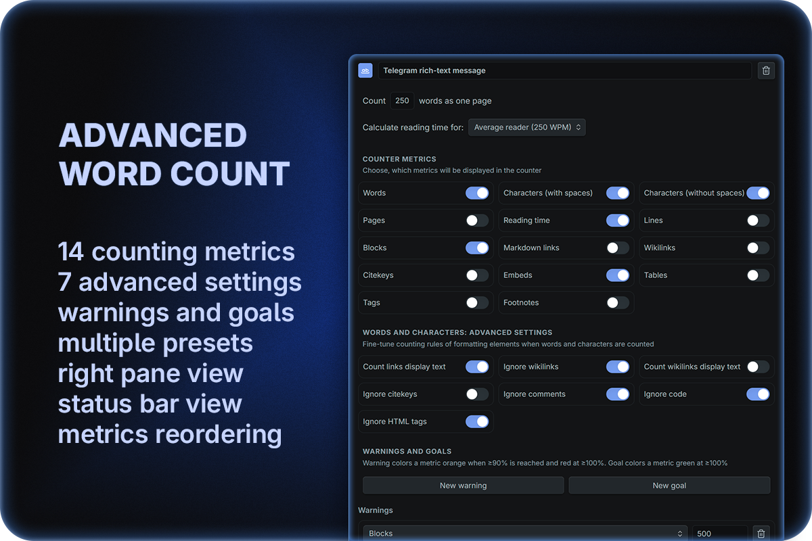
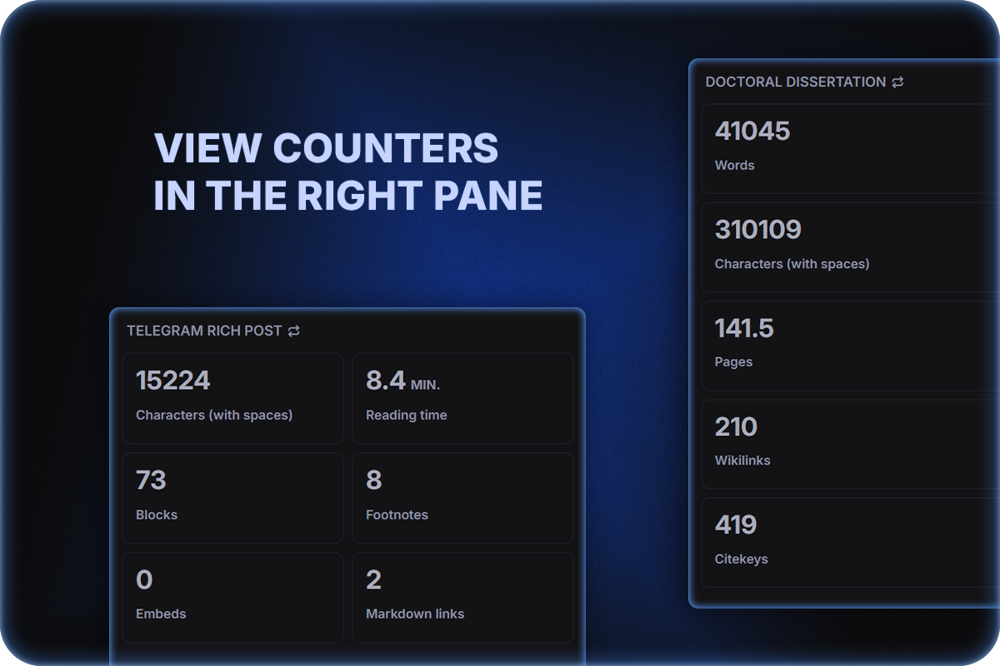
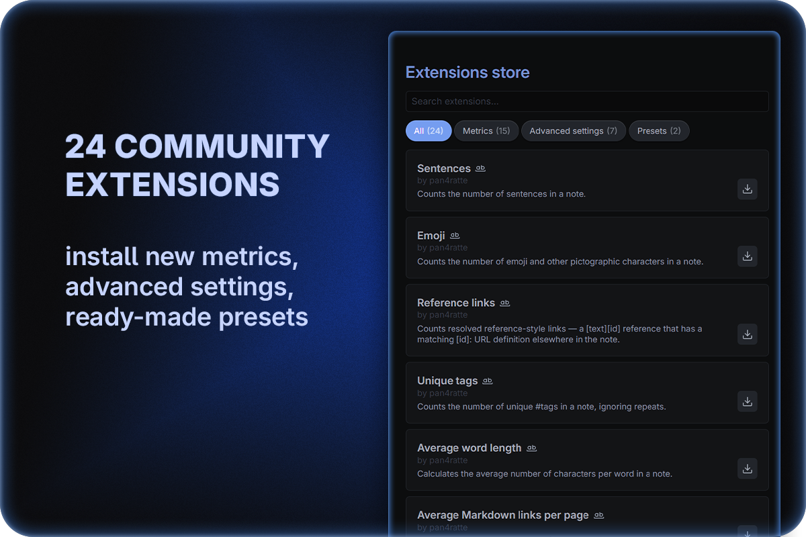

# Плагин Advanced Word Count

[English](https://github.com/pan4ratte/obsidian-advanced-word-count/blob/main/README.md) | Русский

Данный плагин позволяет создавать сложные пресеты счётчиков слов, которые отображаются в строке состояния или во вкладке на правой панели. Пресеты можно переключать нажатием на строку состояния, заголовок правой панели или через палитру команд. Благодаря расширениям сообщества — пресетам, метрикам и расширенным настройкам — плагин гибко настраивается под писательские, научные и другие цели.

  
  
    

## Фичи

### 1. Создание нескольких пресетов счётчиков слов

Каждый отдельный пресет может иметь собственный набор метрик и способов подсчёта элементов форматирования, что упрощает работу над разными проектами. Между пресетами можно быстро переключаться нажатием на строку состояния, название пресета в правой панели или через палитру команд.

### 2. Отображение счётчиков в боковой панели

* Счётчики могут отображаться не только в строке состояния, но и во вкладке правой боковой панели, а также вы можете настроить видимость обоих способов отображения или только одного из них.
* Кроме того, для каждой выбранной метрики можно задать предупреждение о лимите и/или цель: предупреждение окрашивает метрику в оранжевый цвет при достижении ≥90% лимита и в красный при ≥100%, а цель окрашивает её в зелёный при достижении ≥100% (у метрики могут быть одновременно и предупреждение, и цель, причём цель не может быть больше предупреждения).
* Также метрики в правой панели можно менять местами перетаскиванием — новый порядок применяется и к строке состояния (поддержка перетаскивания на мобильных устройствах пока экспериментальная).

### 3. Отслеживание множества разных метрик текста

* Базовые:

	* Слова
	* Страницы
	* Символы (с пробелами)
	* Символы (без пробелов)

* Дополнительные опции:

	* Строки (все строки, включая пустые)
	* Абзацы (блоки текста, пустые строки игнорируются)
	* Время чтения (оценивается на основе выбранной скорости чтения)
	* Markdown-ссылки `(url)[label]` и `[label](url)`
  * Вложения `![[заметка]]` или `![[файл.pdf]]`
  * Сноски — полные сноски `[^1]` и строчные `^[…]`

* Особые "академические" опции:

	* Викиссылки `[[wiki]]` и `[[wiki|label]]`
	* Ключи цитирования `[@doe2020]`

### 4. Тонкая настройка методов подсчёта слов и символов с помощью расширенных настроек

Вы можете указать, как будут подсчитываться элементы форматирования:

| Расширенная настройка	       						  | Выкл.						   											    			    		  | Вкл.		     					   							 |
| :---------------------------------------- | :---------------------------------------------------------- | :------------------------------------- |
| **Считать отображаемый текст ссылок** 	  | `(url)[label]` → label и url будут подсчитаны 						  | только label будет подсчитан           |
| **Игнорировать викиссылки** 		          | текст викиссылок будет подсчитан	   											 	| викиссылки будут игнорироваться	  	   |
| **Считать отображаемый текст викиссылок** | `[[wiki\|label]]` → wiki и label будут подсчитаны 				  | только label будет подсчитан  		     |
| **Игнорировать ключи цитирования** 	      | текст ключей цитирования будет подсчитан 										| ключи цитирования будут игнорироваться |
| **Игнорировать комментарии**			        | текст комментариев `%% … %%` и `<!-- … -->` будет подсчитан	| комментарии будут игнорироваться 	   	 |
| **Игнорировать HTML теги**    		        | HTML теги, как `<b> … </b>` и т.д. будут подсчитаны         | HTML теги будут игнорироваться      	 |

### 5. Установка расширений сообщества: пресетов, метрик и расширенных настроек

**Расширения сообщества** — небольшие дополнения, каждое из которых добавляет одну метрику, одну расширенную настройку подсчёта или готовый пресет.

* **Магазин расширений** открывается в настройках плагина. Ищите по названию, автору или описанию, фильтруйте по типу (метрики / расширенные настройки / пресеты) и устанавливайте, обновляйте или удаляйте любое расширение одним нажатием. Установленные расширения выделяются акцентным цветом.
* **Готовые пресеты** содержат состояния переключателей, расширенные настройки, предупреждения/цели и подключённые расширения сообщества. При установке добавляется к вашим пресетам, а нужные расширения скачиваются автоматически. Создали удачный пресет? Нажмите на иконку "поделиться" в заголовке, чтобы экспортировать файл и предложить его в каталог плагина.
* **Подключение установленных расширений** производится отдельно для каждого вашего пресета: для этого используйте выпадающий список **Расширения сообщества…** внутри пресета.
* **Зависимости устанавливаются автоматически:** если расширение зависит от другого, при установке автоматически скачивается всё необходимое.
* **Обновление расширений** доступно вручную в магазине или автоматически при запуске Obsidian, если включена настройка **Автоматически обновлять расширения сообщества**.

Официальный каталог на данный момент включает:

**Метрики**

| Название | Описание |
| :--- | :---------- |
| Предложения | Считает количество предложений в заметке. |
| Эмодзи | Считает количество эмодзи и других пиктографических символов в заметке. |
| Ссылки референсного стиля | Считает разрешённые ссылки референсного стиля — ссылку вида [text][id], для которой в заметке есть определение [id]: URL. |
| Уникальные теги | Считает количество уникальных #тегов в заметке, игнорируя повторы. |
| Средняя длина слов | Рассчитывает среднее число символов в словах в заметке. |
| Среднее количество md-ссылок на страницу | Рассчитывает среднее число Markdown-ссылок на страницу. |
| Среднее количество слов в предложениях | Рассчитывает среднее число слов в предложениях в заметке. |
| Заголовки | Считает количество Markdown-заголовков (# … ######) в заметке. |
| Задачи (все) | Считает все чекбоксы задач — отмеченные и неотмеченные. |
| Выполненные задачи | Считает только чекбоксы выполненных задач (- [x] или - [X]). |
| Невыполненные задачи | Считает только чекбоксы невыполненных задач (- [ ]). |
| Уникальные ключи цитирования | Считает количество уникальных @ключей цитирования в заметке. |
| Среднее количество цитирований на страницу | Рассчитывает среднее число цитат на страницу. |
| Таблицы | Считает количество полных Markdown-таблиц (заголовок + разделитель) в заметке. |
| Теги | Считает количество #тегов в заметке. |

**Расширенные настройки**

| Название | Описание |
| :--- | :---------- |
| Игнорировать выделения | При подсчёте слов и символов, игнорирует `==выделенные==` фрагменты. |
| Игнорировать формулы | При подсчёте слов и символов, исключает формулы LaTeX — блочные `$$…$$` и строчные `$…$`. |
| Игнорировать таблицы | При подсчёте слов и символов, исключает строки Markdown-таблиц. |
| Игнорировать URL | При подсчёте слов и символов, исключает «голые» http(s)-ссылки. |
| Игнорировать зачёркивания | При подсчёте слов и символов, исключает `~~зачёркнутый~~` текст. |
| Игнорировать поля Dataview | При подсчёте слов и символов, исключает строчные поля Dataview — [key:: value] и (key:: value). |
| Игнорировать код | При подсчёте слов и символов, исключает блочный и строчный код. |

**Пресеты**

| Название | Описание |
| :--- | :---------- |
| Пост в Telegram от лица пользователя | Пресет для постов, сделанных от лица пользователя Telegram: с предупреждениями о лимитах и всеми метриками, настроенными для подсчёта символов так же, как это делает Telegram. |
| Пост в Telegram с rich-text форматированием | Пресет для rich-text постов в Telegram: с предупреждениями о лимитах и всеми метриками, настроенными для подсчёта символов так же, как это делает Telegram. |

Хотите создать своё? См. [руководство для контрибьюторов расширений](https://github.com/pan4ratte/obsidian-advanced-word-count/blob/main/extensions/README.md).

## Установка

### Вариант 1: Магазин плагинов Obsidian

1. Находясь в настройках Obsidian, откройте вкладу "Сторонние плагины" и нажмите на кнопку "Обзор".

2. В поисковой строке введите `Advanced Word Count`, нажмите на результат, затем на кнопки "Установить" и "Включить".

Альтернативно, вы можете установить плагин, перейдя на сайт сообщества по ссылке: [https://community.obsidian.md/plugins/advanced-word-count](https://community.obsidian.md/plugins/advanced-word-count)

### Вариант 2: плагин BRAT

Если вы хотите протестировать бета-версию плагина или предыдущие обновления, вы можете сделать это с помощью плагина `BRAT`:

1. Из официального магазина плагинов Obsidian установите плагин `BRAT`.

2. В настройках `BRAT` найдите раздел "Beta plugin list" и нажмите на кнопку "Add beta plugin".

3. В появившемся окне вставьте ссылку на репозиторий плагина `Advanced Word Count`: [https://github.com/pan4ratte/obsidian-advanced-word-count](https://github.com/pan4ratte/obsidian-advanced-word-count)

4. В пункте "Select a version" выберите нужную версию и нажмите на кнопку "Add plugin". Плагин автоматически установится и будет готов для использования.

## Об авторе

Меня зовут Марк Ингрэм, я религиовед, и кроме своего основного направления исследований (протестантская политическая теология в России), я преподаю предмет "Информационные технологии в научных исследованиях" на основании своей собственной уникальной программы. Данный плагин помогает мне в исследованиях, а также я использую его в преподавании, как и другие плагины, которые я разрабатываю и которые вы можете найти [в моём профиле](https://github.com/pan4ratte/) на GitHub.

Привет всем студентам, которые зашли на эту страницу!
